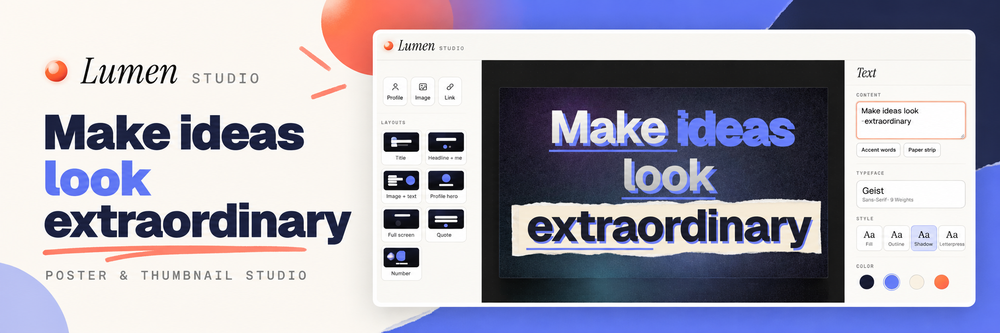

# Lumen — Poster & Thumbnail Studio



A browser-based studio for YouTube thumbnails, blog featured images, LinkedIn banners and social posts. [Open the live studio](https://lumen-poster-generator.vercel.app).

## Features

- **Long-form text that fits** — auto-fit balances lines inside the canvas and gives nearby layers their own space. Drag, resize and align any number of text layers.
- **Style individual phrases** — select the exact words or characters, then click **Accent words** or **Paper strip**. You can also type `*accent*` and `~paper~` directly.
- **Paper on exact selections** — highlight the precise characters you want, then click **Paper strip** or a paper preset. Torn edges, shadows and fibers come in Torn, Notebook, Tape, Newsprint and Dark finishes; unselected text stays unchanged.
- **Vox-style newspaper graphics** — add and edit accent bars, rules with dots, number badges, quote marks, arrows, halftone dots, voxel blocks and frame corners as independent layers. Resize, recolor, reorder and export them.
- **Paper decorations and cute stickers** — add torn or cracked paper, washi tape, scribbles, swirls, cats, birds, flowers, sparkles and hearts as movable, resizable layers. Each can be recolored and appears in the exported poster.
- **Display typography** — Editorial adds an offset and underline; Voxel title adds chunky 3D depth. Paper presets style only the selected text.
- **1,900+ live Google fonts** — searchable, previewed in your own words, with hover-to-preview on the canvas.
- **Auto-style** — reads your text's mood and picks a font pairing, palette and light style.
- **Generated backgrounds** — 12 light styles (aura, spotlight, rays, eclipse, blur, aurora, waves, rings, halftone, grid, mesh, plain) with grain and vignette.
- **Wallpaper & images** — use your macOS wallpaper, the macOS wallpaper library, or any uploaded / pasted / dropped image, with blur, dim, zoom and colour matching.
- **Background removal** — one click removes the background (U²-Net), then click to keep the product or remove a hand, text or logo (SlimSAM). Runs privately in your browser; nothing is uploaded.
- **Links** — paste any link (⌘V) and it's shown beautifully on a soft, blurred backdrop with matched colours:
  - **X / Twitter posts** — full text (never cut), author, verified badge, photos (1–4, side-by-side on wide canvases), quotes, date and stats; Light, Dim, Dark or Glass.
  - **YouTube** — video card with play button, title and channel.
  - **Articles, GitHub and any site** — Card, Hero, Compact or Pill designs.
  - Cards auto-fit the canvas: long content reflows wider, then scales — nothing is ever cropped.
- **Profiles** — save multiple people (LinkedIn, X, GitHub, YouTube, Instagram, website) with photos; show them as chip, card, hero or avatar.
- **More text effects** — shadow, glow, outline, 3D extrusion, editorial, voxel, fade, pill, marker and paper backgrounds.
- **Layouts, undo/redo, export** — one-click layouts, 9 size presets + custom, PNG/JPG/WebP at 1× or 2×.

## Run

Requires Node 20+ (no dependencies). Mac wallpaper features require running locally on macOS; everything else also works on the hosted version (Vercel serverless functions in `api/`).

```bash
npm start
```

Then open http://localhost:5173.

## Test

```bash
npm test
```

## Shortcuts

`T` text · `A` auto-style · `G` new light · `⌘Z` undo · `⌘D` duplicate · `⌘S` export · arrows nudge · `Delete` remove

## License

MIT © Dibyajyoti Kabi

## Credits

Background removal uses [U²-Net](https://github.com/xuebinqin/U-2-Net) (Apache-2.0) and [SlimSAM](https://huggingface.co/Xenova/slimsam-77-uniform) (Apache-2.0) via ONNX Runtime Web and Transformers.js. Fonts from Google Fonts via Fontsource.
